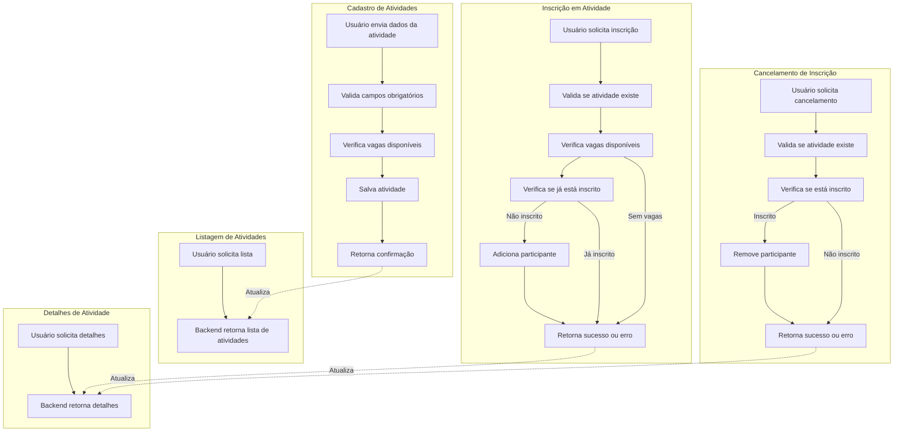

# Primeiros Passos com o GitHub Copilot - Sistema de Atividades Extracurriculares


## Sobre o Projeto

Este é um projeto de demonstração que mostra como utilizar o GitHub Copilot para desenvolver um sistema de gerenciamento de atividades extracurriculares. O projeto foi construído usando Python com FastAPI para o backend e JavaScript puro para o frontend.

## Funcionalidades Implementadas

- ✅ Sistema de cadastro de atividades extracurriculares
- ✅ Interface web responsiva para visualização das atividades
- ✅ Funcionalidade de inscrição em atividades
- ✅ Funcionalidade de cancelamento de inscrição
- ✅ Validação de vagas disponíveis
- ✅ Feedback em tempo real para o usuário

## Tecnologias Utilizadas

- **Backend**: Python 3.13 com FastAPI
- **Frontend**: HTML, CSS e JavaScript vanilla
- **Desenvolvimento**: GitHub Copilot

## Como Executar o Projeto

1. Clone o repositório:
```bash
git clone https://github.com/mrzanela/primeiros-passos-github-copilot.git
cd primeiros-passos-github-copilot
```

2. Instale as dependências:
```bash
pip install -r requirements.txt
```

3. Execute o servidor:
```bash
python -m uvicorn src.app:app --reload
```

4. Acesse no navegador:
```
http://localhost:8000
```

## Estrutura do Projeto

```
src/
  ├── app.py           # Backend da aplicação
  ├── static/         
  │   ├── app.js      # Lógica do frontend
  │   ├── index.html  # Página principal
  │   └── styles.css  # Estilos CSS
  └── README.md       # Documentação
```

## Aprendizados com o GitHub Copilot

Este projeto demonstra como o GitHub Copilot pode acelerar o desenvolvimento:

- 🤖 Geração automática de código repetitivo
- 📝 Sugestões contextuais inteligentes
- 🔄 Refatoração e melhorias de código
- 🐛 Ajuda na identificação e correção de bugs

## Como Contribuir

1. Faça um fork do repositório
2. Crie uma branch para sua feature (`git checkout -b feature/nova-funcionalidade`)
3. Faça commit das suas alterações (`git commit -am 'Adiciona nova funcionalidade'`)
4. Push para a branch (`git push origin feature/nova-funcionalidade`)
5. Abra um Pull Request

## Licença

Este projeto está sob a licença MIT. Veja o arquivo [LICENSE](LICENSE) para mais detalhes.

---

&copy; 2025 GitHub &bull; [Código de Conduta](https://www.contributor-covenant.org/version/2/1/code_of_conduct/code_of_conduct.md) &bull; [Licença MIT](https://gh.io/mit)



